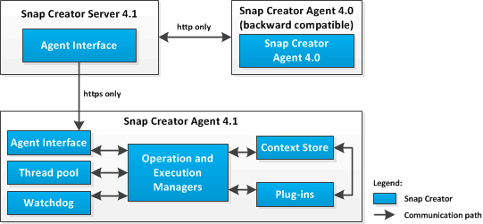

= Panoramica di SNAP Creator Agent
:allow-uri-read: 
:icons: font
:imagesdir: ../media/

[role="lead"]
Snap Creator Agent, in genere installato sullo stesso host in cui è installata un'applicazione o un database, gestisce i comandi di quiesce e unquiesce dal server Snap Creator a una determinata applicazione ed è il luogo in cui si trovano i plug-in. L'agente viene talvolta abbreviato in scAgent all'interno di Snap Creator.

L'agente Snap Creator riceve la comunicazione dall'interfaccia agente del server Snap Creator tramite l'interfaccia agente RESTful e solo tramite HTTPS. Ciò significa comunicazione sicura e crittografata, una funzionalità molto importante negli ambienti multi-tenant e cloud. I certificati autofirmati consentono l'utilizzo di un certificato generato con Snap Creator Agent. Inoltre, Snap Creator Agent è protetto da una combinazione configurabile di utente e password, che viene memorizzata su disco.

La seguente illustrazione mostra l'architettura di Snap Creator Agent:

Il componente Snap Creator Agent (talvolta abbreviato in scAgent all'interno di Snap Creator) include le seguenti parti:

* *Operation and Execution Manager*
+
Operation Manager si occupa delle richieste in entrata, in uscita e completate. L'Execution Manager è responsabile dell'esecuzione delle richieste.

* *Pool di thread*
+
Costituito da thread di lavoro, il pool di thread viene utilizzato per eseguire più attività.

+
Determina il numero di operazioni simultanee in un dato momento. Execution Manager esegue un plug-in e lo esegue in uno dei thread del pool di thread. Se il pool di thread ha otto thread, è possibile eseguire otto operazioni plug-in contemporaneamente. Le nuove operazioni in entrata vengono messe in coda, finché i thread non diventano nuovamente liberi.

* *Watchdog*
+
Attivato da Execution Manager per alcune operazioni, in genere si interrompe, il watchdog richiama Execution Manager dopo un tempo specificato per interrompere l'operazione, se necessario, ed esegue una corrispondente operazione di annullamento. Ad esempio, la funzione di sospensione del plug-in viene chiamata per impostare l'applicazione in una modalità di backup. Il Watchdog inizia ad ascoltare. Se l'operazione non viene eseguita entro l'intervallo di tempo specificato, il watchdog annulla l'applicazione, riportandola alla modalità operativa normale. In questo modo si garantisce che il database non rimanga bloccato in modalità di backup.

* *Archivio di contesto*
+
Mantenendo tutte le informazioni necessarie per l'intero ciclo di vita del flusso di lavoro, l'archivio di contesto fornisce oggetti di contesto al plug-in in base alle necessità e, se un flusso di lavoro non riesce o non viene mai completato, l'oggetto di contesto viene cancellato dopo un certo periodo di tempo.

+
Per i flussi di lavoro che non vengono completati o che non riescono in uno stato non definito, esiste un tempo di contesto massimo specificato in install_path/etc/agent.properties: CONTEXT_LIFETIME_IN_MSEC=1800000 (il valore predefinito, 30 minuti). Se questo valore viene aumentato, Snap Creator Agent occupa più memoria.

* *Plug-in Factory*
+
Plug-in Factory avvia il plug-in e ne garantisce l'esecuzione in uno spazio isolato. La fabbrica del plug-in comunica anche con il Context Store per accedere alle informazioni memorizzate. Consente inoltre di eseguire plug-in nativi e basati su Perl da Snap Creator utilizzando il motore di integrazione plug-in.

+
Snap Creator Agent può anche utilizzare plug-in scritti in lingue diverse da Java.

