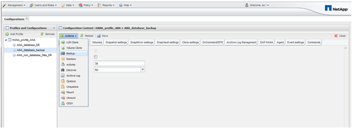

= Backup del database con la GUI di Snap Creator
:allow-uri-read: 
:icons: font
:imagesdir: ../media/

[role="lead"]
È possibile eseguire il backup di un database con la GUI di Snap Creator.

. Selezionare la configurazione *HANA_database_backup*, quindi selezionare *azioni* > *Backup*.
+

. Selezionare il criterio di backup e fare clic su *OK*.
+
image::../media/sap_hana_database_backup_scfw_gui.gif[Questa immagine viene spiegata dal testo circostante.]

+
Il backup viene avviato. Creazione snap attiva "`SnapVault update`" e creazione snap attende fino a quando i dati non vengono replicati nello storage secondario. Il tempo di attesa è stato configurato durante la configurazione e può essere adattato nella scheda SnapVault settings (Impostazioni di attesa). Snap Creator attiva gli aggiornamenti SnapVault in parallelo per ogni volume sullo stesso controller di storage, ma in sequenza per ogni controller di storage.

+
image::../media/sap_hana_database_backup2_scfw_gui.gif[Questa immagine viene spiegata dal testo circostante.]

