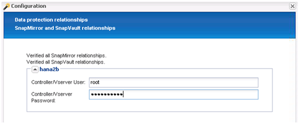

= Configurazione di Snap Creator Framework e backup del database SAP HANA
:allow-uri-read: 
:icons: font
:imagesdir: ../media/

[role="lead"]
È necessario configurare Snap Creator Framework e il backup del database SAP HANA.

. Connettersi all'interfaccia grafica utente (GUI) di Snap Creator: https://host:8443/ui/[].
. Accedere utilizzando il nome utente e la password configurati durante l'installazione. Fare clic su *Accedi*.
+
image::../media/snap_creator_gui.gif[Mostra l'accesso alla GUI di Snap Creator]

. Immettere un nome per il profilo e fare clic su *OK*.
+
image::../media/sap_hana_user_profile.gif[profilo utente sap hana]

+
Ad esempio, "`ANA`" è il SID del database.

. Inserire il nome della configurazione e fare clic su *Avanti*.
+
image::../media/sap_hana_gui_for_configuration_name.gif[Mostra il nome della configurazione immesso nel campo]

. Selezionare *Application plug-in* come tipo di plug-in e fare clic su *Next*.
+
image::../media/sap_hana_config_plugin_type.gif[mostra il plug-in dell'applicazione selezionata]

. Selezionare *SAP HANA* come plug-in dell'applicazione e fare clic su *Avanti*.
+
image::../media/sap_hana_select_application_plug_in.gif[plug-in dell'applicazione sap hana select]

. Immettere i seguenti dettagli di configurazione:
+
.. Selezionare *Sì* dal menu a discesa per utilizzare la configurazione con un database multi-tenant. Per un singolo database container, selezionare *No*.
.. Se il contenitore di database multitenant è impostato su *No*, è necessario fornire il SID del database.
.. Se il contenitore di database multitenant è impostato su *Sì*, è necessario aggiungere le chiavi hdbuserstore per ogni nodo SAP HANA.
.. Aggiungere il nome del database tenant.
.. Aggiungere i nodi HANA su cui deve essere eseguita l'istruzione hdbsql.
.. Inserire il numero di istanza del nodo HANA.
.. Fornire il percorso del file eseguibile hdbsql.
.. Aggiungere l'utente OSDB.
.. Selezionare *Sì* dall'elenco a discesa per attivare la pulizia DEL REGISTRO.
+
NOTA:

+
*** Parametro `HANA_SID` è disponibile solo se il valore per il parametro `HANA_MULTITENANT_DATABASE` è impostato su `N`
*** Per i container di database multi-tenant (MDC) con un tipo di risorsa "`Ssingolo tenant`", le copie Snapshot di SAP HANA funzionano con l'autenticazione basata su chiave di UserStore. Se il `HANA_MULTITENANT_DATABASE` il parametro è impostato su `Y`, quindi il `HANA_USERSTORE_KEYS` il parametro deve essere impostato sul valore appropriato.
*** Analogamente ai container di database non multitenant, è supportata la funzionalità di backup basato su file e di controllo dell'integrità

.. Fare clic su *Avanti*.

+
image::../media/file_based_backup_configuration.gif[configurazione del backup basata su file]

. Abilitare l'operazione di backup basato su file:
+
.. Impostare il percorso di backup del file.
.. Specificare il prefisso file-backup.
.. Selezionare la casella di controllo *Enable file-Backup* (Abilita backup file).
.. Fare clic su *Avanti*.
+
image::../media/enable_file_based_backup.gif[abilitare il backup basato su file]

. Abilitare l'operazione di verifica dell'integrità del database:
+
.. Impostare la posizione di file-Backup temporanea.
.. Selezionare la casella di controllo *attiva controllo integrità DB*.
.. Fare clic su *Avanti*.

+
image::../media/integrity_checks.gif[Verifica dell'integrità del database]

. Inserire i dettagli del parametro di configurazione dell'agente e fare clic su *Avanti*.
+
image::../media/sap_hana_agent_configuration_parameter.gif[Questa immagine viene spiegata dal testo circostante.]

. Inserire le impostazioni di connessione dello storage e fare clic su *Avanti*.
+
image::../media/sap_hana_storage_connect_gui.gif[Questa immagine viene spiegata dal testo circostante.]

. Immettere le credenziali di accesso allo storage e fare clic su *Avanti*.
+
image::../media/sap_hana_storage_login_credentials_gui.gif[Questa immagine viene spiegata dal testo circostante.]

. Selezionare i volumi di dati memorizzati su questo controller di storage e fare clic su *Save* (Salva).
+
image::../media/sap_hana_select_data_volumes.gif[Questa immagine viene spiegata dal testo circostante.]

. Fare clic su *Add* (Aggiungi) per aggiungere un altro controller di storage.
+
image::../media/sap_hana_add_controller.gif[Questa immagine viene spiegata dal testo circostante.]

. Immettere le credenziali di accesso allo storage e fare clic su *Avanti*.
+
image::../media/sap_hana_storage_login_credentials2.gif[Questa immagine viene spiegata dal testo circostante.]

. Selezionare i volumi di dati memorizzati nel secondo controller di storage creato e fare clic su *Save* (Salva).
+
image::../media/sap_hana_controller_volumes_selection.gif[Questa immagine viene spiegata dal testo circostante.]

. La finestra Controller/Vserver Credentials (credenziali controller/server virtuale) visualizza i controller e i volumi di storage aggiunti. Fare clic su *Avanti*.
+
image::../media/sap_hana_view_storage_credentials.gif[Questa immagine viene spiegata dal testo circostante.]

. Inserire il criterio Snapshot e la configurazione di conservazione.
+
La conservazione di tre copie Snapshot giornaliere e otto copie Snapshot orarie è solo un esempio e può essere configurata in modo diverso a seconda delle esigenze del cliente.

+

NOTE: Selezionare *Timestamp* come convenzione di denominazione. L'utilizzo della convenzione di denominazione *Recent* non è supportato con il plug-in SAP HANA, in quanto la data e l'ora della copia Snapshot viene utilizzata anche per le voci del catalogo di backup SAP HANA.

+
image::../media/sap_hana_snapshot_details_gui.gif[Questa immagine viene spiegata dal testo circostante.]

. Non sono richieste modifiche. Fare clic su *Avanti*.
+
image::../media/sap_hana_snapshot_details_continued_gui.gif[Questa immagine viene spiegata dal testo circostante.]

. Selezionare *SnapVault* e configurare i criteri di conservazione SnapVault e il tempo di attesa SnapVault.
+
image::../media/sap_hana_data_protection_gui.gif[Questa immagine viene spiegata dal testo circostante.]

. Fare clic su *Aggiungi*.
+
image::../media/sap_hana_data_protection_volumes.gif[Questa immagine viene spiegata dal testo circostante.]

. Selezionare un controller di storage di origine dall'elenco e fare clic su *Avanti*.
+
image::../media/sap_hana_dp_volumes_gui_select_storage_controller.gif[Questa immagine viene spiegata dal testo circostante.]

. Selezionare tutti i volumi memorizzati nel controller dello storage di origine e fare clic su *Save* (Salva).
+
image::../media/sap_hana_volume_selection_gui.gif[Questa immagine viene spiegata dal testo circostante.]

. Fare clic su *Aggiungi*, selezionare il secondo controller storage di origine dall'elenco, quindi fare clic su *Avanti*.
+
image::../media/sap_hana_configuration_data_protection_volumes_select_controller.gif[Questa immagine viene spiegata dal testo circostante.]

. Selezionare tutti i volumi memorizzati nel secondo controller di storage di origine e fare clic su *Save* (Salva).
+
image::../media/sap_hana_data_protection_volume_selection.gif[Questa immagine viene spiegata dal testo circostante.]

. La finestra Data Protection Volumes (volumi di protezione dati) visualizza tutti i volumi che devono essere protetti nella configurazione creata. Fare clic su *Avanti*.
+
image::../media/sap_hana_data_protection_volumes_gui.gif[Questa immagine viene spiegata dal testo circostante.]

. Immettere le credenziali per i controller di storage di destinazione e fare clic su *Avanti*. In questo esempio, le credenziali utente "`root`" vengono utilizzate per accedere al sistema di storage. In genere, un utente di backup dedicato viene configurato sul sistema di storage e quindi utilizzato con Snap Creator.
+

. Fare clic su *Avanti*.
+
image::../media/sap_hana_dfm_oncommand_settings_gui.gif[GUI di impostazione DFM/OnCommand. Questa immagine viene spiegata dal testo circostante.]

. Fare clic su *fine* per completare la configurazione.
+
image::../media/sap_hana_data_protection_configuration_summary.gif[Questa immagine viene spiegata dal testo circostante.]

. Fare clic sulla scheda *SnapVault settings*.
. Selezionare *Sì* dall'elenco a discesa dell'opzione *attesa ripristino SnapVault* e fare clic su *Salva*.
+
image::../media/sap_hana_snapvault_settings_gui.gif[Questa immagine viene spiegata dal testo circostante.]

+
Si consiglia di utilizzare una rete dedicata per il traffico di replica. Se si decide di farlo, è necessario includere questa interfaccia nel file di configurazione di Snap Creator come interfaccia secondaria.

+
È inoltre possibile configurare interfacce di gestione dedicate in modo che Snap Creator possa accedere al sistema di storage di origine o di destinazione utilizzando un'interfaccia di rete non associata al nome host del controller di storage.

+
[listing]
----
mgmtsrv01:/opt/NetApp/Snap_Creator_Framework_411/scServer4.1.1c/engine/configs/HANA_profile_ANA
# vi ANA_database_backup.conf

#####################################################################
########################
#     Connection Options                                            #
#####################################################################
########################
PORT=443
SECONDARY_INTERFACES=hana1a:hana1a-rep/hana2b;hana1b:hana1b-rep/hana2b
MANAGEMENT_INTERFACES=hana2b:hana2b-mgmt
----

