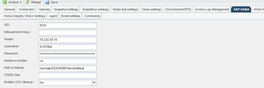

= Modifica della gestione dei backup dei log
:allow-uri-read: 
:icons: font
:imagesdir: ../media/

[role="lead"]
È possibile modificare i parametri configurati per la gestione dei backup dei log se si desidera disattivare l'operazione di pulizia dei log.

. Selezionare il profilo SAP HANA che si desidera modificare.
. Selezionare la configurazione che si desidera modificare e fare clic su *SAP HANA Settings* (Impostazioni SAP HANA).
. Modificare il parametro Enable LOG cleanup (attiva pulitura REGISTRO) e fare clic su *Save* (Salva).
+

