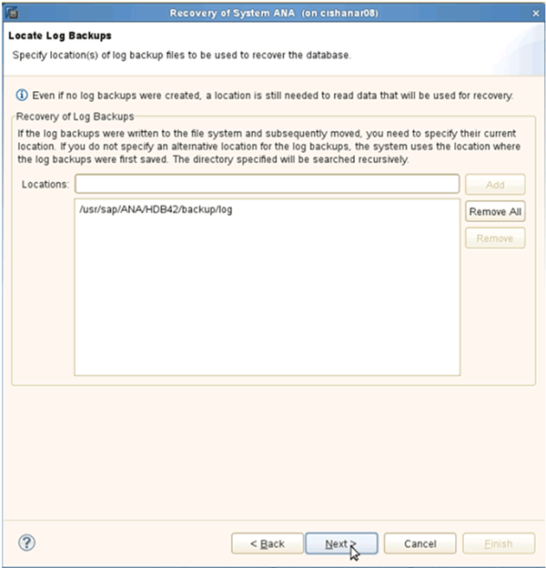

= Ripristino e ripristino dei database dallo storage secondario
:allow-uri-read: 
:icons: font
:imagesdir: ../media/

[role="lead"]
È possibile ripristinare e ripristinare il database dallo storage secondario.

. In SAP HANA Studio, selezionare *Recover* per il sistema SAP HANA.
+
image::../media/sap_hana_recovery_secondary_storage_gui.gif[Questa immagine viene spiegata dal testo circostante.]

+
Il sistema SAP HANA viene arrestato.

. Selezionare il tipo di ripristino e fare clic su *Avanti*.
+
image::../media/sap_hana_secondary_specify_recovery_type.gif[Questa immagine viene spiegata dal testo circostante.]

. Fornire le posizioni di backup del registro e fare clic su *Avanti*.
+

+
L'elenco dei backup disponibili viene visualizzato in base al contenuto del catalogo di backup.

. Selezionare il backup richiesto e annotare l'ID del backup esterno.
+
image::../media/sap_hana_recover_secondary_select_backup.gif[Questa immagine viene spiegata dal testo circostante.]

. Accedere alla GUI di Snap Creator.
. Selezionare il sistema SAP HANA, quindi fare clic su *azioni* > *Ripristina*.
+
image::../media/sap_hana_secondary_select_backup_restore.gif[Questa immagine viene spiegata dal testo circostante.]

+
Viene visualizzata la schermata di benvenuto.

+
image::../media/sap_hana_secondary_welcome_screen.gif[Questa immagine viene spiegata dal testo circostante.]

. Fare clic su *Avanti*.
. Selezionare *secondario* e fare clic su *Avanti*.
+
image::../media/sap_hana_secondary_restore.gif[Questa immagine viene spiegata dal testo circostante.]

. Inserire le informazioni richieste. Il nome Snapshot è correlato all'ID di backup selezionato in SAP HANA Studio.
+
image::../media/sap_hana_select_backup_restore04_secondary_scf_gui.gif[Questa immagine viene spiegata dal testo circostante.]

. Selezionare *fine*.
+
image::../media/sap_hana_secondary_restore_summary.gif[Questa immagine viene spiegata dal testo circostante.]

. Fare clic su *Sì* per aggiungere altri elementi da ripristinare.
+
image::../media/sap_hana_secondary_snapshot_settings_warning.gif[Questa immagine viene spiegata dal testo circostante.]

. Fornire le informazioni necessarie per tutti i volumi che devono essere ripristinati. Nel setup data_00001, data_00002 e data_00003 devono essere selezionati per il processo di ripristino.
+
image::../media/sap_hana_secondary_snapvault_restore.gif[Questa immagine viene spiegata dal testo circostante.]

. Una volta selezionati tutti i volumi, selezionare *OK* per avviare il processo di ripristino.
+
Attendere il completamento del processo di ripristino.

. Su ciascun nodo del database, rimontare tutti i volumi di dati per pulire "`Stali NFS Handles`".
+
Nell'esempio, tutti e tre i volumi devono essere rimontati in ciascun nodo del database.

+
[listing]
----
mount -o remount /hana/data/ANA/mnt00001
mount -o remount /hana/data/ANA/mnt00002
mount -o remount /hana/data/ANA/mnt00003
----
. Accedere a SAP HANA Studio e fare clic su *Refresh* per aggiornare l'elenco di backup.
+
image::../media/sap_hana_secondary_select_backup_to_recover.gif[Questa immagine viene spiegata dal testo circostante.]

. Il backup ripristinato con Snap Creator viene visualizzato con un'icona verde nell'elenco dei backup. Selezionare il backup e fare clic su *Avanti*.
. Selezionare le altre impostazioni desiderate e fare clic su *Avanti*.
+
image::../media/sap_hana_secondary_other_settings.gif[Questa immagine viene spiegata dal testo circostante.]

. Fare clic su *fine*.
+
image::../media/sap_hana_secondary_review_recovery_settings.gif[Questa immagine viene spiegata dal testo circostante.]

+
Viene avviato il processo di ripristino.

+
image::../media/sap_hana_secondary_recovery_progress_information.gif[Questa immagine viene spiegata dal testo circostante.]

. Al termine del processo di ripristino, riprendere le relazioni SnapVault, se necessario.
+
image::../media/sap_hana_secondary_recovery_execution_summary.gif[Questa immagine viene spiegata dal testo circostante.]

