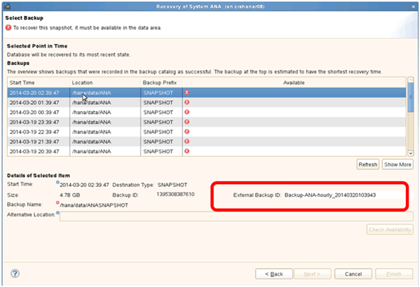
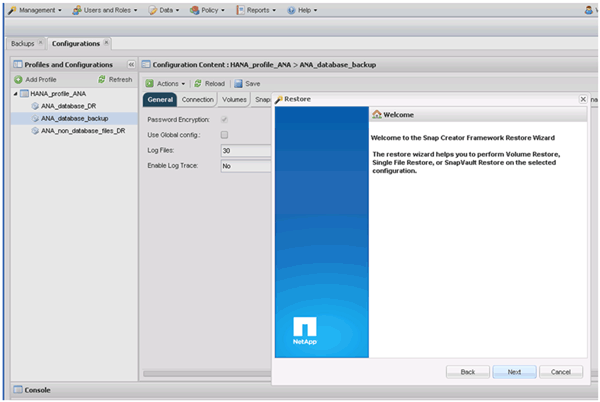
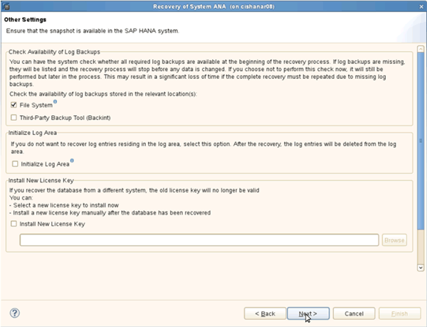

= Ripristino e ripristino dei database dallo storage primario
:allow-uri-read: 
:icons: font
:imagesdir: ../media/

[role="lead"]
È possibile ripristinare e ripristinare il database dallo storage primario.

NOTE: Non è possibile ripristinare copie di backup basate su file da Snap Creator.

. In SAP HANA Studio, selezionare *Recover* per il sistema SAP HANA.
+
image::../media/sap_hana_recover_primary_gui.gif[Questa immagine viene spiegata dal testo circostante.]

+
Il sistema SAP HANA si spegne.

. Selezionare il tipo di ripristino e fare clic su *Avanti*.
+
image::../media/sap_hana_specify_recovery_type_gui.gif[Questa immagine viene spiegata dal testo circostante.]

. Fornire le posizioni di backup del registro e fare clic su *Avanti*.
+
image::../media/sap_hana_recover_primary_log_backup_location.gif[Questa immagine viene spiegata dal testo circostante.]

+
L'elenco dei backup disponibili viene visualizzato in base al contenuto del catalogo di backup.

. Selezionare il backup richiesto e registrare l'ID del backup esterno.
+

. Disattivare la relazione SnapVault.
+

NOTE: Questo passaggio è necessario solo con Clustered Data ONTAP.

+
Se è necessario ripristinare una copia Snapshot precedente alla copia Snapshot attualmente utilizzata come copia Snapshot di base per SnapVault, è necessario prima disattivare la relazione SnapVault in Clustered Data ONTAP. A tale scopo, eseguire i seguenti comandi sulla console del cluster di backup:

+
[listing]
----
hana::> snapmirror quiesce -destination-path hana2b:backup_hana_data
Operation succeeded: snapmirror quiesce for destination hana2b:backup_hana_data.

hana::> snapmirror delete -destination-path hana2b:backup_hana_data
Operation succeeded: snapmirror delete the relationship with destination hana2b:backup_hana_data.

hana::> snapmirror release -destination-path hana2b:backup_hana_data
[Job 6551] Job succeeded: SnapMirror Release Succeeded
----
. Nella GUI di Snap Creator, selezionare il sistema SAP HANA, quindi selezionare *azioni* > *Ripristina*.
+
image::../media/sap_hana_select_restore_backup.gif[Questa immagine viene spiegata dal testo circostante.]

+
Viene visualizzata la schermata iniziale di Snap Creator Framework Restore Wizard (Ripristino guidato di Snap Creator Framework).

. Fare clic su *Avanti*.
+

. Selezionare *primario* e fare clic su *Avanti*.
+
image::../media/sap_hana_primary_restore_primary_select.gif[Questa immagine viene spiegata dal testo circostante.]

. Selezionare Restore from primary storage (Ripristina dallo storage primario)
. Selezionare il controller dello storage, il nome del volume e il nome Snapshot.
+
Il nome Snapshot è correlato all'ID di backup selezionato in SAP HANA Studio.

+
image::../media/sap_hana_select_backup_restore_scf_gui.gif[Questa immagine viene spiegata dal testo circostante.]

. Fare clic su *fine*.
+
image::../media/sap_hana_primary_restore_summary.gif[Questa immagine viene spiegata dal testo circostante.]

. Fare clic su *Sì* per aggiungere altri elementi di ripristino.
+
image::../media/sap_hana_add_more_restore_items.gif[Questa immagine viene spiegata dal testo circostante.]

. Selezionare il controller dello storage, il nome del volume aggiuntivo e il nome Snapshot.
+
Il nome Snapshot è correlato all'ID di backup selezionato in SAP HANA Studio.

+
image::../media/sap_hana_primary_select_restore_details.gif[Questa immagine viene spiegata dal testo circostante.]

. Ripetere i passaggi da 10 a 13 fino all'aggiunta di tutti i volumi richiesti; nel nostro esempio, è necessario selezionare data_00001, data_00002 e data_00003 per il processo di ripristino.
. Una volta selezionati tutti i volumi, fare clic su *OK* per avviare il processo di ripristino.
+
image::../media/sap_hana_select_volume_restore.gif[Questa immagine viene spiegata dal testo circostante.]

+
Il processo di ripristino viene avviato.

+
image::../media/sap_hana_primary_general_restore_process_in_progress.gif[Questa immagine viene spiegata dal testo circostante.]

+
Attendere il completamento del processo di ripristino.

. Su ciascun nodo di database, rimontare tutti i volumi di dati per eliminare gli handle NFS obsoleti.
+
Nell'esempio, tutti e tre i volumi devono essere rimontati in ciascun nodo del database.

+
[listing]
----
mount -o remount /hana/data/ANA/mnt00001
mount -o remount /hana/data/ANA/mnt00002
mount -o remount /hana/data/ANA/mnt00003
----
. Accedere a SAP HANA Studio e fare clic su *Refresh* per aggiornare l'elenco dei backup disponibili.
+
image::../media/sap_hana_primary_select_backup.gif[Questa immagine viene spiegata dal testo circostante.]

+
Il backup ripristinato con Snap Creator viene visualizzato con un'icona verde nell'elenco dei backup.

. Selezionare il backup e fare clic su *Avanti*.
+
image::../media/sap_hana_select_backup_to_recover_database.gif[Questa immagine viene spiegata dal testo circostante.]

. Selezionare le altre impostazioni desiderate e fare clic su *Avanti*.
+

. Fare clic su *fine*.
+
image::../media/sap_hana_primary_review_recory_settings.gif[Questa immagine viene spiegata dal testo circostante.]

+
Viene avviato il processo di ripristino.

+
image::../media/sap_hana_primary_recovery_progress_information.gif[Questa immagine viene spiegata dal testo circostante.]

. Al termine del ripristino, riprendere le relazioni SnapVault, se necessario.
+
image::../media/sap_hana_primary_recovery_execution_summary.gif[Questa immagine viene spiegata dal testo circostante.]

