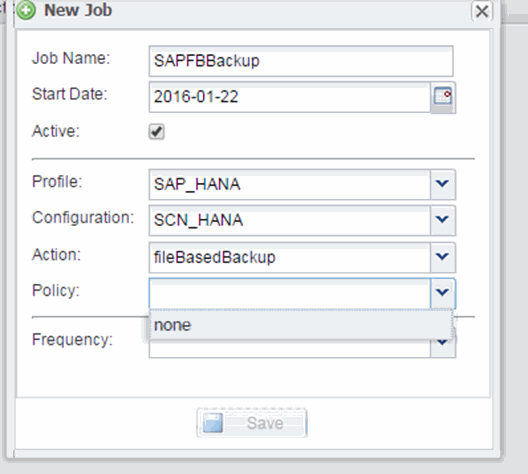

= Pianificazione del backup basato su file
:allow-uri-read: 
:icons: font
:imagesdir: ../media/

[role="lead"]
Per le configurazioni SAP HANA, è possibile pianificare operazioni aggiuntive come backup basato su file e controlli dell'integrità del database. È possibile pianificare l'esecuzione dell'operazione di backup basata su file a intervalli specifici.

. Dal menu principale della GUI di Snap Creator, selezionare *Management* > *Schedules* e fare clic su *Create*.
. Nella finestra nuovo lavoro, immettere i dettagli del lavoro.
+
Il criterio di backup basato su file è impostato su "`none`" per impostazione predefinita.

+

